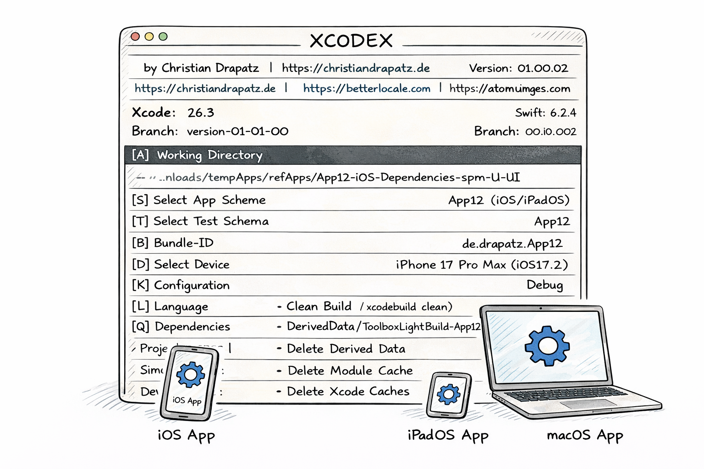

# XCODEX — Xcode Developer Toolbox

A lightweight, cursor-driven CLI app for iOS and macOS developers.  
Combines Clean & Cache, Dependencies, Build & Run, Simulator, Test, and Xcode control in a single cursor-driven split-pane menu.  
Available in **German** and **English**.

---

## Why this tool?

In everyday Apple development, you constantly switch between Xcode, Terminal, and various CLI tools like `xcodebuild` or `xcrun simctl`. Each tool has its own flags, its own syntax, and its own pitfalls.

**XCODEX** bundles the most important workflows into a single, instantly accessible entry point:

- **No flag lookup** — all common workflows are available as menu entries
- **No context switching** — Build, Test, Clean, and Simulator control run in the same terminal
- **Ready to use** — no external dependencies, runs wherever Xcode is installed
- **Fast navigation** — arrow keys control the menu, Enter executes the command



---

## Own DerivedData — Independent from Xcode

The script uses its own DerivedData to run builds and tests, making it completely independent from Xcode. This means Xcode can stay open in the background — indexing or building on its own — without interfering. Each run happens in its own environment, so when something fails you can be confident the issue comes from the script, not leftover state. The downside: nothing is reused, so the first run does a full clean build, which takes longer and uses more disk space.


---

## Branch & Commit — Build and Compare Specific States

The script can check out any branch or commit from the Git repository, build it locally and launch it. Because it runs independently from Xcode, parallel builds are possible, making it easy to compare different project states side by side. It also lowers the barrier for non-iOS developers who need to run an iOS build without a full development environment set up.


---

## Installation

### 1. Download repository

```bash
git clone https://github.com/drapatzc/xcodex.git ~/GIT-Home/xcodex
```

### 2. Set execution permissions

```bash
chmod +x ~/GIT-Home/xcodex/xcodex
```

### 3. Set up alias (optional, but recommended)

So you can launch the tool from anywhere in the terminal by typing `xcodex`:

**zsh (default on modern Macs):**

```bash
echo 'alias xcodex="$HOME/GIT-Home/xcodex/xcodex"' >> ~/.zshrc
source ~/.zshrc
```

**bash:**

```bash
echo 'alias xcodex="$HOME/GIT-Home/xcodex/xcodex"' >> ~/.bash_profile
source ~/.bash_profile
```

### 4. Test

```bash
xcodex
```

---

## Updating

```bash
cd ~/GIT-Home/xcodex
git pull
```

---

## Getting started

Run the tool from the **root directory of your Xcode project**:

```bash
cd MyXcodeProject
xcodex
```

The tool automatically detects `.xcworkspace` or `.xcodeproj` files in the current directory.

---

## Controls

The menu is split into two columns: categories on the left, actions on the right.

| Key | Action |
|-----|--------|
| `↑` `↓` | Move through entries in the active column |
| `←` `→` | Switch between category and action column |
| `Enter` | Execute the selected command |
| `Q` | Quit the app |
| `S` | Select scheme |
| `D` | Select device / simulator |
| `K` | Configuration (Debug / Release) |
| `B` | Set bundle ID |
| `L` | Switch language (DE / EN) |
| `A` | Select working directory |

Settings are saved persistently in `~/.xcode_toolbox_prefs.json`.

---

## Features

### Clean & Cache

| Action | Description |
|--------|-------------|
| xcodebuild clean | Clean the project via xcodebuild |
| Delete toolbox build | Delete only the app-specific DerivedData folder |
| Delete DerivedData | Delete the entire DerivedData folder |
| Delete Module Cache | Clean the Xcode Module Cache |
| Delete Simulator Cache | Empty CoreSimulator caches |
| Delete Xcode Caches | Clean internal Xcode caches |
| Delete caches (without SPM) | Delete all caches except SPM in one step |
| Delete caches (incl. package managers) | Delete all caches including detected package managers |

### Dependencies

| Action | Description |
|--------|-------------|
| Dependencies | Show resolved SPM dependencies |
| Resolve | Synchronise SPM, CocoaPods, and Carthage |

### Build & Run

| Action | Description |
|--------|-------------|
| Build | Compile the app |
| Build & Run | Build and launch directly in the Simulator / on macOS |
| Quick Reset & Build | Delete app build folder → Build → Launch |
| Full Reset & Build | Delete all caches → Build → Launch |

### Simulator

| Action | Description |
|--------|-------------|
| Launch app | Launch the last built app in the Simulator |
| Relaunch app | Relaunch the app on the selected Simulator |
| Restart Simulator | Restart the running Simulator |
| Stop Simulator | Quit the running Simulator |
| Reset Simulator | Erase Simulator data |
| Screenshot | Take a screenshot (→ Desktop) |
| Video recording | Start / stop a screen recording (→ Desktop) |
| Dark / Light Mode | Toggle the Simulator appearance |

### Test

| Action | Description |
|--------|-------------|
| Run unit tests | Start unit tests with speed optimisations |
| Run UI tests | Start UI tests |
| Run all tests | Run unit and UI tests together |

### Misc

| Action | Description |
|--------|-------------|
| Tools & Versions | Show installed versions of Xcode, Swift, CocoaPods, Carthage, SwiftLint, SwiftFormat |
| File Metrics | Analyse all .swift files (lines, functions, risk) |
| Project Metrics | Aggregated overall project overview |

### Xcode

| Action | Description |
|--------|-------------|
| Close Xcode | Quit the Xcode process |
| Open project | Open the current project in Xcode |

---

## Requirements

| Requirement | Notes |
|-------------|-------|
| **macOS 13+** | Tested from macOS Ventura onwards |
| **Xcode** | Including Xcode Command Line Tools (`xcode-select --install`) |
| **Swift 5.9+** | Included with Xcode |

No further external dependencies required.

---

## Technical details

- **Language:** Swift (Swift Package Manager)
- **Platform:** macOS (Executable Target)
- **UI:** Cursor-driven split-pane menu with ANSI colours
- **Persistence:** JSON file at `~/.xcode_toolbox_prefs.json`
- **Signal handling:** `Ctrl+C` safely aborts running operations
- **No external dependencies** — only Foundation and Xcode Command Line Tools
- **Build optimisation:** `-parallelizeTargets`, `COMPILER_INDEX_STORE_ENABLE=NO`, `ONLY_ACTIVE_ARCH=YES`, and in Debug mode `SWIFT_COMPILATION_MODE=incremental`

---

## Developer

I build software for the Apple ecosystem — native iOS and macOS apps, games, and developer tools.

### Portfolio

**[christiandrapatz.de](https://christiandrapatz.de)**

### AI Apps

**[betterlocale.com](https://betterlocale.com)**

- [BetterLocale Crash](https://betterlocale.com/en-crash/)
- [BetterLocale Code](https://betterlocale.com/en-code/)
- [BetterLocale Store](https://betterlocale.com/en-store/)
- [BetterLocale Doc](https://betterlocale.com/en-doc/)
- [BetterLocale MarkDown](https://betterlocale.com/en-markdown/)

### Games

**[atomiumgames.com](https://atomiumgames.com)**

- [crazy-monsters.com](https://crazy-monsters.com)
- [tower-arena.com](https://tower-arena.com)
- [strategy-war.com](https://strategy-war.com)
- [battle-alliance.com](https://battle-alliance.com)

### Apps

**[onetwoapps.de](https://www.onetwoapps.de)**

- [scanbox-app.de](https://scanbox-app.de)
- [meinhaushaltsbuch.app](https://meinhaushaltsbuch.app)

---

## Author

Christian Drapatz — [christiandrapatz.de](https://christiandrapatz.de) — 2026

## Licence

This project is not released under an open-source licence.  
All rights reserved.
