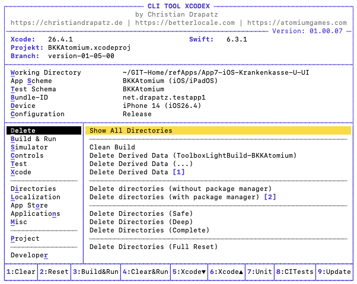
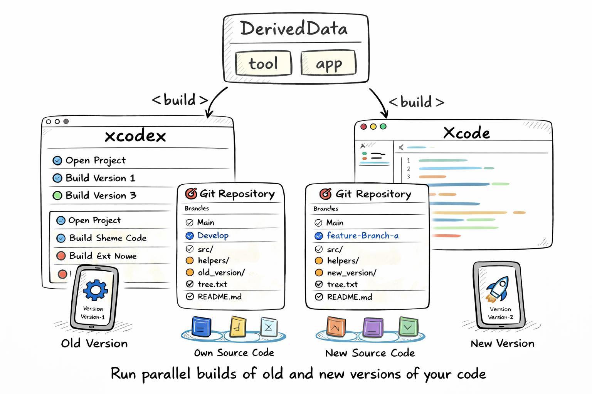

<div align="center">

# xcodex

**A cursor-driven CLI tool for iOS, iPadOS and macOS developers**

[](https://www.apple.com/macos/)
[](https://swift.org)
[](LICENSE.txt)
[](#language)
[](https://www.apple.com/macos/)

*Not affiliated with Apple or Xcode.*

[🌐 Website](https://xcodex.betterlocale.com) · [📖 Tutorial](https://xcodex.betterlocale.com/tutorial.html) · [📋 Release Notes](https://xcodex.betterlocale.com/releasenotes.html) · [🇩🇪 Deutsche README](README-NEW.md)



</div>

---

## Table of Contents

- [What is xcodex?](#what-is-xcodex)
- [What makes it special?](#what-makes-it-special)
- [Who is it for?](#who-is-it-for)
- [Highlights](#highlights)
- [Installation](#installation)
- [Quick Start](#quick-start)
- [Controls](#controls)
- [Feature Overview](#feature-overview)
- [Requirements](#requirements)
- [Honest Limitations](#honest-limitations)
- [Technical Details](#technical-details)
- [Author](#author)
- [License](#license)

---

## What is xcodex?

`xcodex` is a cursor-driven terminal tool that bundles typical Xcode workflows into a single interface — no window switching, no looking up flags, no waiting for Xcode.

As an Apple developer, you constantly switch between Xcode, Terminal and tools like `xcodebuild` or `simctl`. Every command has its own flags, its own syntax — and every time it costs you time. `xcodex` addresses exactly that.

```
cd MyXcodeProject
xcodex
```

---

## What makes it special?

### Own DerivedData — Clean and Isolated

`xcodex` builds into its **own DerivedData folder** — completely independent of Xcode. Both can run simultaneously without getting in each other's way. Every build starts in a fresh environment: no old remnants, no side effects.



### Branch & Commit — Build and Compare Selectively

Check out any branch or commit, build locally and launch — without touching your own development environment. Parallel builds allow you to cleanly compare different project states.


---

## Who is it for?

`xcodex` is not just for iOS developers:

| Target Group | Benefit |
|---|---|
| **iOS/macOS Developers** | Build fast, test, clean caches — without Xcode |
| **Android Developers** | Check out and test the current iOS state — without Xcode knowledge |
| **QA & Testers** | Build directly from source — no waiting for TestFlight |
| **Designers** | See changes immediately in context, on different iOS versions |
| **Product Owners** | Retrieve the current state at any time and present spontaneously |

---

## Highlights

- **Multi-Simulator** — iOS 16, 17, 18 in sequence with the same flags, reproducible, without Xcode GUI
- **Granular Cache Control** — 10+ options (DerivedData, SPM, CocoaPods, Simulator Cache …) with size display
- **Build Timeline** — ASCII diagram after every build: instantly see which phase is slowing things down
- **Retry Failed Tests in Isolation** — only the broken tests, on a different simulator
- **All Package Managers in One Place** — SPM, CocoaPods, Carthage: update, clear cache, display dependency graph
- **Simulator Directly in Terminal** — Screenshot, MP4 recording, Dark/Light Mode — without Xcode
- **Persistence** — Scheme, device and bundle ID are saved; next session starts in seconds

---

## Installation

There are two ways to install xcodex:

### Option A — Installer Package (recommended)

Download the notarized **xcodex.pkg** directly from the [xcodex website](https://xcodex.betterlocale.com). Apple has reviewed and approved the file — it opens without security warnings. The installer places `xcodex` at `/usr/local/bin/xcodex` automatically. No Git clone or manual path setup required.

To update: download the new version and run the installer again.

### Option B — Git Clone

#### 1. Clone Repository

```bash
git clone https://github.com/drapatzc/xcodex.git ~/Developer/xcodex
```

#### 2. Set Execution Permissions

```bash
chmod +x ~/Developer/xcodex/xcodex
```

#### 3. Set Up Alias (zsh)

```bash
echo 'alias xcodex="$HOME/Developer/xcodex/xcodex"' >> ~/.zshrc
source ~/.zshrc
```

#### 4. Test

```bash
xcodex
```

#### Update

```bash
cd ~/Developer/xcodex && git pull
```

---

## Quick Start

Run the tool in the **root directory of your Xcode project**:

```bash
cd MyXcodeProject
xcodex
```

`xcodex` automatically detects `.xcworkspace` and `.xcodeproj` files. On first launch:

1. `[W]` Select working directory
2. `[S]` Select app scheme
3. `[D]` Select device / simulator
4. `[C]` Set build configuration (Debug / Release)
5. `Enter` — get started

---

## Controls

The menu is split into two columns: categories on the left, actions on the right.

| Key | Action |
|---|---|
| `↑` `↓` | Switch entry in the active column |
| `←` `→` | Switch between category and action column |
| `Enter` | Execute the selected command |
| `Shift+Q` | Quit the app |
| `S` | Select scheme |
| `D` | Select device / simulator |
| `C` | Configuration (Debug / Release) |
| `B` | Set bundle ID |
| `L` | Switch language (DE / EN) |
| `W` | Select working directory |

---

## Feature Overview

<details>
<summary><strong>Clean & Cache</strong></summary>

| Action | Description |
|---|---|
| Show all directories | Cache browser with size display and selective deletion |
| Clean build | Clean compiled artifacts of the current scheme |
| Delete DerivedData (project) | Delete only the project-specific DerivedData folder |
| Delete DerivedData | Delete the entire DerivedData folder |
| Delete directories (without package managers) | DerivedData, Xcode caches, Simulator cache |
| Delete directories (with package managers) | + CocoaPods, Carthage and SPM caches |
| Delete directories (Safe) | DerivedData, ModuleCache, SwiftPM, Xcode caches, Simulator cache, Logs |
| Delete directories (Deep) | Everything from Safe + Archives, iOS DeviceSupport, all simulator devices |
| Delete directories (Complete) | Everything from Deep + all package manager caches; optional Simulator Runtimes |
| Delete directories (Restart) | Full reset including SourcePackages for a clean project restart |

</details>

<details>
<summary><strong>Build & Run</strong></summary>

| Action | Description |
|---|---|
| Validate | Check project for configuration errors |
| Dependencies / Package managers | Resolve SPM, CocoaPods and Carthage dependencies |
| Project configuration | Show all build settings for the selected scheme |
| Build | Compile the project without launching |
| Build & Run | Build and launch directly in Simulator / on macOS |
| Clean (without package managers) & Build & Run | Delete caches, rebuild and launch |
| Clean (with package managers) & Build & Run | Delete all caches including package managers, rebuild and launch |

</details>

<details>
<summary><strong>Simulator</strong></summary>

| Action | Description |
|---|---|
| Create new simulator | Select runtime and device type, create via simctl |
| Launch app | Launch the built app on the selected simulator |
| Reinstall & test fresh | Uninstall and reinstall the app for a clean state |
| Restart simulator | Shut down and restart the simulator |
| Stop simulator | Terminate the running simulator |
| Reset simulator | Erase all simulator data |
| Simulator status | List all simulators grouped by runtime with color-coded state |
| Stop all simulators | Stop all running simulators at once |
| Delete unavailable simulators | Remove simulators without an installed runtime |
| Clear simulator caches | Remove temporary CoreSimulator caches |

</details>

<details>
<summary><strong>Controls (Simulator remote control)</strong></summary>

Appearance, permissions, language, runtime, data, logs and more — all without leaving the terminal.

| Category | Examples |
|---|---|
| Interaction | Push notification test, deep link |
| Appearance | Dark/Light Mode, Status Bar mock, Dynamic Type, Bold Text, Reduce Motion |
| Permissions | Grant/reset camera, microphone, location, photos, contacts and 14 more |
| Language & Region | Set app language, system language, 24h format |
| Runtime | Slow animations, launch arguments, env variables, memory pressure simulation |
| Device & System | Set location, battery status, cellular mode, timezone, WLAN/Cellular signal |
| Data | Add media, clear Keychain, open app data folder, reset UserDefaults |
| Logs & Diagnostics | Stream app logs, open crash log, Privacy Manifest validation |
| Live Activities | Start, update and stop Live Activities |
| WidgetKit | Reload widget timelines, clear widget cache |
| App Clips | Test App Clip URL, reset App Clip experience |

</details>

<details>
<summary><strong>Test</strong></summary>

| Action | Description |
|---|---|
| Run Unit Tests | Start unit tests |
| Run UI Tests | Start UI tests in the simulator |
| Run All Tests | Run unit and UI tests together |
| Re-run failed tests | Re-run only the failed tests without repeating the full suite |
| Code Coverage | Run tests with coverage enabled and display results per file |
| Automated Tests | Combine scheme, device and configuration for repeatable test runs |

</details>

<details>
<summary><strong>Xcode Integration</strong></summary>

| Action | Description |
|---|---|
| Tools & versions | Show installed versions of Xcode, Swift, CocoaPods, SwiftLint and more |
| Close Xcode | Terminate Xcode process |
| Restart Xcode | Close and reopen Xcode |
| Open project in Xcode | Open the current project in Xcode |
| Switch Xcode version | Switch the active Xcode version via xcode-select |
| Install / Uninstall Xcode version | Manage Xcode versions via Xcodes |
| Install Command Line Tools | Trigger the macOS CLT installation dialog |
| Reset Xcode preferences | Delete Xcode plist (for UI freezes or broken shortcuts) |

</details>

<details>
<summary><strong>App Store & Distribution</strong></summary>

| Action | Description |
|---|---|
| Archive | Create a release archive |
| Validate | Check the archive before upload |
| Upload to TestFlight | Upload for beta testing |
| Upload to App Store | Submit for App Store review |

> macOS apps are automatically notarized and stapled before upload.

</details>

<details>
<summary><strong>Localization</strong></summary>

| Action | Description |
|---|---|
| Missing localizations | Keys missing in at least one language |
| Unused localizable keys | Keys not referenced in code |
| Duplicate translation keys | Keys appearing multiple times in the same file |
| Inconsistent placeholders | Mismatched `%@`, `%d` etc. between languages |
| Empty translations | Keys with an empty value |
| Translation statistics | Progress bar per language from `.xcstrings` |
| Search key / value | Interactive search in `.xcstrings` |
| Export XLIFF | Create translation packages for external translators |

</details>

<details>
<summary><strong>Directories</strong></summary>

Open important Xcode paths directly in Finder: DerivedData, SourcePackages, Module Cache, Xcode Caches, Simulators, Archives, DiagnosticReports, Provisioning Profiles and more — with a single keystroke.

</details>

<details>
<summary><strong>Miscellaneous</strong></summary>

| Action | Description |
|---|---|
| Analyze Crash Reports | Symbolize `.crash` files and display readable stack traces |
| Instruments (Beta) | Start profiling sessions directly from xcodex |
| Manage Provisioning Profiles | List all local profiles, remove expired ones |
| File Metrics | Analyze all `.swift` files (lines, functions, risk) |
| Project Metrics | Aggregated project overview |

</details>

<details>
<summary><strong>Project — Isolated Development Environments</strong></summary>

Clone a repository into a separate directory. Your own development environment remains untouched. Useful for QA, testing feature branches in parallel, or comparing builds from different commits.

</details>

---

## Requirements

### Required

| Requirement | Details |
|---|---|
| **Mac** | macOS Ventura 13 or later (macOS only) |
| **Xcode** | Fully installed via App Store (~30 GB) |
| **Command Line Tools** | `sudo xcode-select --switch /Applications/Xcode.app` |

### Optional (detected automatically)

| Tool | Purpose | Installation |
|---|---|---|
| CocoaPods | If `Podfile` is in the project | `brew install cocoapods` |
| Carthage | If `Cartfile` is in the project | `brew install carthage` |
| SwiftLint | Code quality | `brew install swiftlint` |
| xcbeautify | Readable build output | `brew install xcbeautify` |
| xcodes CLI | Manage multiple Xcode versions | `brew install xcodesorg/made/xcodes` |

> SPM is included in Xcode — no separate installation needed.

### One-Time Setup Effort

| Step | Time |
|---|---|
| Install Xcode | 30–60 min (download dependent) |
| Set up `xcode-select` | 1 min |
| Install xcodex (pkg or clone + alias) | 2 min |
| Configure project (press W) | 3–5 min |
| **Total** | **~1 hour** |

After that: the next session starts in under 10 seconds.

---

## Honest Limitations

| Limitation | Details |
|---|---|
| **No Breakpoint Debugging** | The app launches via `simctl` / `devicectl` — Xcode's debugger is not attached |
| **Code Signing on Physical Devices** | Automatic provisioning works; manual signing configurations may fail |
| **Multi-Simulator is Sequential** | Running iOS 16, 17 and 18 simultaneously is not possible — that is CI territory |
| **Compiler Index** | Builds via `xcodex` do not update Xcode's code completion database |
| **Simulator ≠ Real Device** | Camera and hardware sensors cannot be fully simulated |

---

## When to Use Which Tool?

| Task | Tool |
|---|---|
| Develop features, breakpoints, debugging | Xcode |
| Build fast + launch on simulator | xcodex |
| Clean caches when Xcode misbehaves | xcodex |
| Test on multiple simulators | xcodex |
| Test app on physical device | xcodex |
| Debug app on physical device | Xcode |
| Update SPM / Pods / Carthage | xcodex |
| Screenshots / Videos from Simulator | xcodex |

---

## Technical Details

| Property | Details |
|---|---|
| **Language** | Swift (Swift Package Manager) |
| **Platform** | macOS (Executable Target) |
| **UI** | Cursor-driven split-pane menu with ANSI colors |
| **Persistence** | `~/.xcode_toolbox_prefs.json` |
| **Signal Handling** | `Ctrl+C` safely aborts running operations |
| **Dependencies** | None external — only Foundation and Xcode Command Line Tools |
| **Build Flags** | `-parallelizeTargets`, `COMPILER_INDEX_STORE_ENABLE=NO`, `ONLY_ACTIVE_ARCH=YES` |

> The source code is private — only the executable binary is distributed.

---

## Language

The tool is fully available in **German** and **English**.  
Switch at runtime: press `L`.

- [🇩🇪 Deutsche README](README-NEW.md)
- [🇬🇧 English README](README_EN.md)

---

## Author

**Christian Drapatz**

iOS/macOS Developer · [christiandrapatz.de](https://christiandrapatz.de)

### Other Projects

| Category | Project |
|---|---|
| AI Apps | [betterlocale.com](https://betterlocale.com) |
| Games | [atomiumgames.com](https://atomiumgames.com) |
| Apps | [onetwoapps.de](https://www.onetwoapps.de) |

---

## License

This project is **not** published under an open-source license.  
All rights reserved. · © 2026 Christian Drapatz
