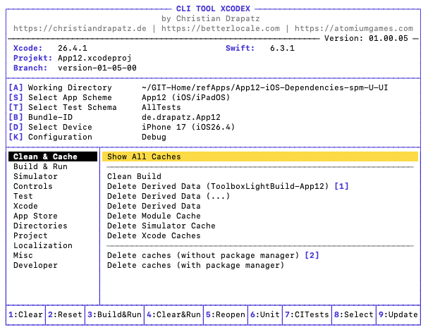

<div align="center">

# xcodex

**A cursor-driven CLI tool for iOS, iPadOS and macOS developers**

[](https://www.apple.com/macos/)
[](https://swift.org)
[](LICENSE.txt)
[](#language)
[](https://www.apple.com/macos/)

*Not affiliated with Apple or Xcode.*

[🌐 Website](https://xcodex.betterlocale.com) · [📖 Tutorial](https://xcodex.betterlocale.com/tutorial.html) · [📋 Release Notes](https://xcodex.betterlocale.com/releasenotes.html) · [🇩🇪 Deutsche README](README-NEW.md)



</div>

---

## Table of Contents

- [What is xcodex?](#what-is-xcodex)
- [What makes it special?](#what-makes-it-special)
- [Who is it for?](#who-is-it-for)
- [Highlights](#highlights)
- [Installation](#installation)
- [Quick Start](#quick-start)
- [Controls](#controls)
- [Feature Overview](#feature-overview)
- [Requirements](#requirements)
- [Honest Limitations](#honest-limitations)
- [Technical Details](#technical-details)
- [Author](#author)
- [License](#license)

---

## What is xcodex?

`xcodex` is a cursor-driven terminal tool that bundles typical Xcode workflows into a single interface — no window switching, no looking up flags, no waiting for Xcode.

As an Apple developer, you constantly switch between Xcode, Terminal and tools like `xcodebuild` or `simctl`. Every command has its own flags, its own syntax — and every time it costs you time. `xcodex` addresses exactly that.

```
cd MyXcodeProject
xcodex
```

---

## What makes it special?

### Own DerivedData — Clean and Isolated

`xcodex` builds into its **own DerivedData folder** — completely independent of Xcode. Both can run simultaneously without getting in each other's way. Every build starts in a fresh environment: no old remnants, no side effects.


### Branch & Commit — Build and Compare Selectively

Check out any branch or commit, build locally and launch — without touching your own development environment. Parallel builds allow you to cleanly compare different project states.


---

## Who is it for?

`xcodex` is not just for iOS developers:

| Target Group | Benefit |
|---|---|
| **iOS/macOS Developers** | Build fast, test, clean caches — without Xcode |
| **Android Developers** | Check out and test the current iOS state — without Xcode knowledge |
| **QA & Testers** | Build directly from source — no waiting for TestFlight |
| **Designers** | See changes immediately in context, on different iOS versions |
| **Product Owners** | Retrieve the current state at any time and present spontaneously |

---

## Highlights

- **Multi-Simulator** — iOS 16, 17, 18 in sequence with the same flags, reproducible, without Xcode GUI
- **Granular Cache Control** — 10+ options (DerivedData, SPM, CocoaPods, Simulator Cache …) with size display
- **Build Timeline** — ASCII diagram after every build: instantly see which phase is slowing things down
- **Retry Failed Tests in Isolation** — only the broken tests, on a different simulator
- **All Package Managers in One Place** — SPM, CocoaPods, Carthage: update, clear cache, display dependency graph
- **Simulator Directly in Terminal** — Screenshot, MP4 recording, Dark/Light Mode — without Xcode
- **Persistence** — Scheme, device and bundle ID are saved; next session starts in seconds

---

## Installation

### 1. Clone Repository

```bash
git clone https://github.com/drapatzc/xcodex.git ~/GIT-Home/xcodex
```

### 2. Set Execution Permissions

```bash
chmod +x ~/GIT-Home/xcodex/xcodex
```

### 3. Set Up Alias (zsh)

```bash
echo 'alias xcodex="$HOME/GIT-Home/xcodex/xcodex"' >> ~/.zshrc
source ~/.zshrc
```

### 4. Test

```bash
xcodex
```

### Update

```bash
cd ~/GIT-Home/xcodex && git pull
```

---

## Quick Start

Run the tool in the **root directory of your Xcode project**:

```bash
cd MyXcodeProject
xcodex
```

`xcodex` automatically detects `.xcworkspace` and `.xcodeproj` files. On first launch:

1. `[A]` Select working directory
2. `[S]` Select app scheme
3. `[D]` Select device / simulator
4. `[K]` Set build configuration (Debug / Release)
5. `Enter` — get started

---

## Controls

The menu is split into two columns: categories on the left, actions on the right.

| Key | Action |
|---|---|
| `↑` `↓` | Switch entry in the active column |
| `←` `→` | Switch between category and action column |
| `Enter` | Execute the selected command |
| `Q` | Quit the app |
| `S` | Select scheme |
| `D` | Select device / simulator |
| `K` | Configuration (Debug / Release) |
| `B` | Set bundle ID |
| `L` | Switch language (DE / EN) |
| `A` | Select working directory |

---

## Feature Overview

<details>
<summary><strong>Clean & Cache</strong></summary>

| Action | Description |
|---|---|
| `xcodebuild clean` | Clean project via xcodebuild |
| Delete Toolbox Build | Delete only the app-specific DerivedData folder |
| Delete DerivedData | Delete the entire DerivedData folder |
| Delete Module Cache | Clean Xcode module cache |
| Delete Simulator Cache | Clear CoreSimulator caches |
| Delete Xcode Caches | Clean internal Xcode caches |
| Delete Caches (without SPM) | Delete all caches except SPM in one step |
| Delete Caches (with Package Manager) | Delete all caches including detected package managers |

</details>

<details>
<summary><strong>Dependencies</strong></summary>

| Action | Description |
|---|---|
| Dependencies | Show resolved SPM dependencies |
| Resolve | Synchronize SPM, CocoaPods and Carthage |

</details>

<details>
<summary><strong>Build & Run</strong></summary>

| Action | Description |
|---|---|
| Build | Compile the app |
| Build & Run | Build and launch directly in Simulator / on macOS |
| Quick Reset & Build | Delete app build folder → Build → Launch |
| Full Reset & Build | Delete all caches → Build → Launch |

</details>

<details>
<summary><strong>Simulator</strong></summary>

| Action | Description |
|---|---|
| Launch App | Launch the last built app in the simulator |
| Relaunch App | Restart app on the selected simulator |
| Restart Simulator | Restart the running simulator |
| Stop Simulator | Terminate the running simulator |
| Reset Simulator | Delete simulator data (Erase) |
| Screenshot | Take a screenshot (→ Desktop) |
| Video Recording | Start/stop screen recording (→ Desktop) |
| Dark/Light Mode | Toggle the simulator's appearance |

</details>

<details>
<summary><strong>Test</strong></summary>

| Action | Description |
|---|---|
| Run Unit Tests | Start unit tests with speed optimizations |
| Run UI Tests | Start UI tests |
| Run All Tests | Run unit and UI tests together |

</details>

<details>
<summary><strong>Xcode, Metrics & Misc</strong></summary>

| Action | Description |
|---|---|
| Close Xcode | Terminate Xcode process |
| Open Project | Open the current project in Xcode |
| Tools & Versions | Display Xcode, Swift, CocoaPods, Carthage, SwiftLint versions |
| File Metrics | Analyze all `.swift` files (lines, functions, risk) |
| Project Metrics | Aggregated project overview |

</details>

---

## Requirements

### Required

| Requirement | Details |
|---|---|
| **Mac** | macOS Ventura 13 or later (macOS only) |
| **Xcode** | Fully installed via App Store (~30 GB) |
| **Command Line Tools** | `sudo xcode-select --switch /Applications/Xcode.app` |

### Optional (detected automatically)

| Tool | Purpose | Installation |
|---|---|---|
| CocoaPods | If `Podfile` is in the project | `sudo gem install cocoapods` |
| Carthage | If `Cartfile` is in the project | `brew install carthage` |
| SwiftLint | Code quality | `brew install swiftlint` |

> SPM is included in Xcode — no separate installation needed.

### One-Time Setup Effort

| Step | Time |
|---|---|
| Install Xcode | 30–60 min (download dependent) |
| Set up `xcode-select` | 1 min |
| Clone repository + set alias | 2 min |
| Configure project (press A) | 3–5 min |
| **Total** | **~1 hour** |

After that: the next session starts in under 10 seconds.

---

## Honest Limitations

| Limitation | Details |
|---|---|
| **No Breakpoint Debugging** | The app launches via `simctl` / `devicectl` — Xcode's debugger is not attached |
| **Code Signing on Physical Devices** | Automatic provisioning works; manual signing configurations may fail |
| **Multi-Simulator is Sequential** | Testing iOS 16, 17 and 18 simultaneously is not possible — that is CI territory |
| **Compiler Index** | Builds via `xcodex` do not update Xcode's code completion database |
| **No IPA Export** | Distribution without TestFlight is not supported |
| **Simulator ≠ Real Device** | Camera, push notifications and hardware cannot be simulated |

---

## When to Use Which Tool?

| Task | Tool |
|---|---|
| Develop features, breakpoints, debugging | Xcode |
| Build fast + launch on simulator | xcodex |
| Clean caches when Xcode misbehaves | xcodex |
| Test on multiple simulators | xcodex |
| Test app on physical device | xcodex |
| Debug app on physical device | Xcode |
| Update SPM / Pods / Carthage | xcodex |
| Screenshots / Videos from Simulator | xcodex |

---

## Technical Details

| Property | Details |
|---|---|
| **Language** | Swift (Swift Package Manager) |
| **Platform** | macOS (Executable Target) |
| **UI** | Cursor-driven split-pane menu with ANSI colors |
| **Persistence** | `~/.xcode_toolbox_prefs.json` |
| **Signal Handling** | `Ctrl+C` safely aborts running operations |
| **Dependencies** | None external — only Foundation and Xcode Command Line Tools |
| **Build Flags** | `-parallelizeTargets`, `COMPILER_INDEX_STORE_ENABLE=NO`, `ONLY_ACTIVE_ARCH=YES` |

> The source code is private — only the executable binary is distributed.

---

## Language

The tool is fully available in **German** and **English**.  
Switch at runtime: press `L`.

- [🇩🇪 Deutsche README](README-NEW.md)
- [🇬🇧 English README](README_EN.md)

---

## Author

**Christian Drapatz**

iOS/macOS Developer · [christiandrapatz.de](https://christiandrapatz.de)

### Other Projects

| Category | Project |
|---|---|
| AI Apps | [betterlocale.com](https://betterlocale.com) |
| Games | [atomiumgames.com](https://atomiumgames.com) |
| Apps | [onetwoapps.de](https://www.onetwoapps.de) |

---

## License

This project is **not** published under an open-source license.  
All rights reserved. · © 2026 Christian Drapatz
