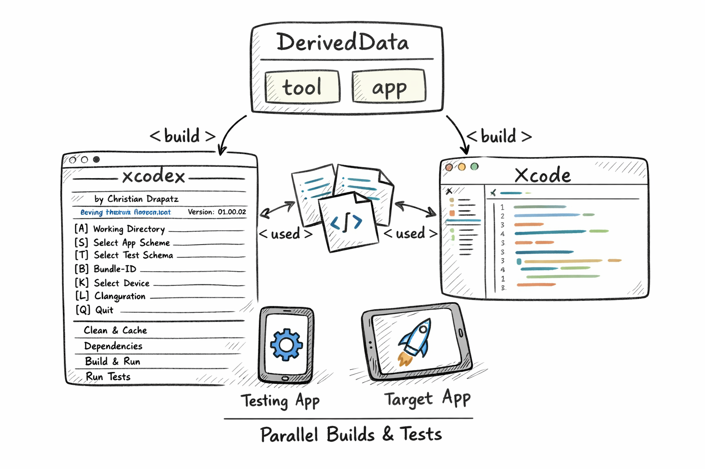

# XCODEX — Xcode Developer Toolbox

A cursor-driven CLI app for iOS and macOS developers.  
Over 400 functions for builds, tests, simulator control, code quality, and Git analysis — all in one keyboard-driven terminal cockpit.  
Available in **German** and **English**.

---

## Why This Tool?

As an Apple developer, you constantly switch between Xcode, Terminal, and tools like `xcodebuild` or `simctl`. Every tool has its own flags, its own syntax — and each time it costs time to get back up to speed.

The Xcode Developer Toolbox addresses exactly that: no window switching, no flag lookups, no waiting for Xcode.


Once you've tried it, you won't want to start typical Xcode tasks any other way.

---

## How Xcode Normally Builds

Xcode writes all build artifacts into a shared DerivedData folder at `~/Library/Developer/Xcode/DerivedData/`. Compiled files, index data, logs, and temporary build products from all projects land there simultaneously. When a build runs, Xcode accesses exactly this folder — and every other parallel process does the same. This usually works fine, but when Xcode is indexing in the background, another build is running, or old remnants from a previous project are still there, silent conflicts can occur: builds fail for unclear reasons, caches are incorrectly reused, errors can't be reproduced. The classic remedy — "Clean Build Folder" — deletes everything and rebuilds from scratch, but costs time and doesn't solve the actual cause.



---

## What Makes This Tool Special

### Own DerivedData — Clean and Isolated

The script builds into its own DerivedData folder — completely independent of Xcode. Both can run simultaneously without getting in each other's way. Every run starts in a fresh environment: no old remnants, no side effects. When something goes wrong, you know immediately: it comes from the current state — not from a cache from yesterday.


---

### Branch & Commit — Build and Compare Selectively

Check out any branch or commit, build locally, and launch — without touching your own development environment. Through parallel builds, different project states can be cleanly compared.


The special thing: not only iOS developers benefit from this.

- **Android developers** can check out and test the current iOS state at any time — without Xcode knowledge
- **QA and testers** don't have to wait for TestFlight — build and test directly from source code
- **Designers** see changes immediately in context, on different iOS versions
- **Product owners** can retrieve the current state at any time and present spontaneously

---

### Further Highlights

- **Multi-Simulator:** iOS 16, 17, 18 sequentially — same flags, reproducible, without Xcode GUI
- **Granular cache control:** 10+ options (DerivedData, SPM, CocoaPods, Simulator Cache …) with size display beforehand
- **Build timeline:** ASCII diagram (Gantt / Block Flow) after every build — immediately see which phase is slowing things down
- **Re-run failed tests in isolation:** only the broken tests on a different simulator, without rebuilding everything
- **Package managers under one roof:** SPM, CocoaPods, Carthage — update all three, clear cache, display dependency graphs
- **Simulator directly in terminal:** screenshot, MP4 recording, Dark/Light Mode toggle — without touching Xcode
- **Persistence:** schema, device, bundle ID remain saved — next session starts in seconds

---

## What Works Well

The script is a solid second tool alongside Xcode:

| Task | Tool |
|------|------|
| Feature development, breakpoints, debugging | Xcode |
| Quick build + launch on simulator | Script |
| Clean cache when Xcode misbehaves | Script |
| Tests on multiple simulators | Script |
| Test app on physical device (simple) | Script |
| Debug app on physical device | Xcode |
| Update SPM / Pods / Carthage | Script |
| Screenshots / videos from simulator | Script |

---

## Honest Limitations

- **No breakpoint debugging:** The app launches via `simctl` / `devicectl` — Xcode's debugger is not attached. For breakpoints, Xcode remains the right tool.
- **Code signing on physical devices:** Automatic provisioning works. Manual signing configurations or enterprise profiles may fail — that's an `xcodebuild` limitation, not a script bug.
- **Multi-simulator is sequential:** Testing iOS 16, 17, and 18 simultaneously is not possible. True parallelism is CI territory (Fastlane, Xcode Cloud).
- **Compiler index is not updated:** Builds in the script don't update Xcode's code-completion database — intentional, but good to know.
- **No IPA export:** The built app runs on simulator or directly connected device. Distribution without TestFlight is not intended.

---

## 10 Reasons Why It's Worth It

1. Multi-simulator before PR — test iOS 16, 17, 18 without waiting for CI
2. No TestFlight waiting — QA and PO build directly from source code
3. Android developer friendly — familiar terminal, no Xcode knowledge needed
4. Granular cache control — no more blunt "Clean Build Folder"
5. Build timeline — immediately see what's slowing the build down
6. Usable by non-developers — press A, configure, app runs
7. Re-run failed tests in isolation — only the broken ones, on desired simulator
8. All package managers in one place — SPM, CocoaPods, Carthage
9. One-time setup — settings remain saved
10. Free, no accounts, no infrastructure — ready to use immediately

---

## 10 Things to Know (Honestly)

1. Xcode must be installed (~30 GB) — even for Android developers
2. No IPA export — no distribution without TestFlight
3. Physical device requires signing — hurdle without a development certificate
4. Build errors show raw `xcodebuild` output — can be overwhelming
5. No visual iOS-vs-Android comparison side by side
6. Multi-simulator is sequential, not parallel
7. Simulator ≠ real device (camera, push notifications, hardware)
8. Project must be checked out locally — basic Git knowledge required
9. No automatic team update — manual version synchronization
10. Missing simulator runtimes fail silently — must be installed beforehand

---

## Prerequisites for Android Developers & Non-iOS Developers

### Required — Without This Nothing Works

**1. Mac with macOS Ventura 13 or newer**  
The script is macOS-only. No Windows, no Linux.

**2. Xcode (full version, from the App Store)**  
- App Store → "Xcode" → Install (~30 GB)
- Open once so Apple can install the components
- Xcode can remain closed afterwards — the script takes over everything
- Run once in Terminal:

```bash
sudo xcode-select --switch /Applications/Xcode.app
```

**3. iOS Simulator Runtimes**  
For older iOS versions, install via Xcode:  
Xcode → Settings → Platforms → download desired version

### Effort — One-Time, Not Recurring

| Step | Time |
|------|------|
| Install Xcode | 30–60 min (download dependent) |
| Set up `xcode-select` | 1 min |
| Clone script + set alias | 2 min |
| Configure project (press A) | 3–5 min |
| **Total** | **~1 hour, one-time** |

After that: next session starts in 10 seconds.

### Optional Tools (only if the project needs them)

The script automatically detects if they are missing and shows a warning.

| Tool | For | Installation |
|------|-----|-------------|
| CocoaPods | If `Podfile` in project | `sudo gem install cocoapods` |
| Carthage | If `Cartfile` in project | `brew install carthage` |
| SwiftLint | Code quality | `brew install swiftlint` |

SPM is included in Xcode — no separate installation needed.

---

## Installation

### 1. Download the Repository

```bash
git clone https://github.com/drapatzc/xcodex.git ~/GIT-Home/xcodex
```

### 2. Set Execute Permissions

```bash
chmod +x ~/GIT-Home/xcodex/xcodex
```

### 3. Set Up Alias (zsh)

```bash
echo 'alias xcodex="$HOME/GIT-Home/xcodex/xcodex"' >> ~/.zshrc
source ~/.zshrc
```

### 4. Test

```bash
xcodex
```

---

## Update

```bash
cd ~/GIT-Home/xcodex
git pull
```

---

## Launch

Run the tool in the **root directory of the Xcode project**:

```bash
cd MyXcodeProject
xcodex
```

The tool automatically detects `.xcworkspace` or `.xcodeproj` files in the current directory.

---

## Controls

The menu is split into two columns: categories on the left, actions on the right.

| Key | Action |
|-----|--------|
| `↑` `↓` | Switch entry in the active column |
| `←` `→` | Switch between category and action column |
| `Enter` | Execute selected command |
| `Q` | Quit app |
| `S` | Choose scheme |
| `D` | Choose device / simulator |
| `K` | Configuration (Debug / Release) |
| `B` | Set bundle ID |
| `L` | Switch language (DE / EN) |
| `A` | Choose working directory |

Settings are persistently stored in `~/.xcode_toolbox_prefs.json`.

---

## Features

### Clean & Cache

| Action | Description |
|--------|-------------|
| `xcodebuild clean` | Clean project via xcodebuild |
| Delete toolbox build | Delete only the app-specific DerivedData folder |
| Delete DerivedData | Delete entire DerivedData folder |
| Delete module cache | Clean Xcode module cache |
| Delete simulator cache | Clear CoreSimulator caches |
| Delete Xcode caches | Clean internal Xcode caches |
| Delete caches (without SPM) | All caches except SPM in one step |
| Delete caches (with package manager) | All caches including detected package managers |

### Dependencies

| Action | Description |
|--------|-------------|
| Dependencies | Show resolved SPM dependencies |
| Resolve | Synchronize SPM, CocoaPods, and Carthage |

### Build & Run

| Action | Description |
|--------|-------------|
| Build | Compile app |
| Build & Run | Build and launch directly in simulator / on macOS |
| Quick Reset & Build | Delete app build folder → Build → Launch |
| Full Reset & Build | Delete all caches → Build → Launch |

### Simulator

| Action | Description |
|--------|-------------|
| Launch app | Launch last built app in simulator |
| Restart app | Restart app on selected simulator |
| Restart simulator | Restart running simulator |
| Stop simulator | Terminate running simulator |
| Reset simulator | Delete simulator data (Erase) |
| Screenshot | Take screenshot (→ Desktop) |
| Video recording | Start/stop screen recording (→ Desktop) |
| Dark/Light Mode | Toggle simulator appearance |

### Test

| Action | Description |
|--------|-------------|
| Run unit tests | Start unit tests with speed optimizations |
| Run UI tests | Start UI tests |
| Run all tests | Run unit and UI tests together |

### Other

| Action | Description |
|--------|-------------|
| Tools & versions | Show Xcode, Swift, CocoaPods, Carthage, SwiftLint, SwiftFormat versions |
| File metrics | Analyze all `.swift` files (lines, functions, risk) |
| Project metrics | Aggregated project overview |

### Xcode

| Action | Description |
|--------|-------------|
| Close Xcode | Terminate Xcode process |
| Open project | Open current project in Xcode |

---

## Architecture & Source Code

The scripts (`toolbox` and `xcodex`) are publicly available on GitHub, along with reference apps for testing with different Xcode setups (SPM, CocoaPods, Carthage, with/without unit and UI tests). The actual source code is private — only the executable version is provided.

### Technical Details

| Property | Details |
|----------|---------|
| **Language** | Swift (Swift Package Manager) |
| **Platform** | macOS (Executable Target) |
| **UI** | Cursor-driven Split-Pane menu with ANSI colors |
| **Persistence** | JSON file at `~/.xcode_toolbox_prefs.json` |
| **Signal handling** | `Ctrl+C` safely aborts running operations |
| **Dependencies** | None external — only Foundation and Xcode Command Line Tools |
| **Build optimization** | `-parallelizeTargets`, `COMPILER_INDEX_STORE_ENABLE=NO`, `ONLY_ACTIVE_ARCH=YES`, in Debug mode `SWIFT_COMPILATION_MODE=incremental` |

---

## Developer

I build software for the Apple ecosystem — native iOS and macOS apps, my own games, and developer tools.

### Portfolio

**[christiandrapatz.de](https://christiandrapatz.de)**

### AI Apps

**[betterlocale.com](https://betterlocale.com)**

- [BetterLocale Crash](https://betterlocale.com/en-crash/)
- [BetterLocale Code](https://betterlocale.com/en-code/)
- [BetterLocale Store](https://betterlocale.com/en-store/)
- [BetterLocale Doc](https://betterlocale.com/en-doc/)
- [BetterLocale MarkDown](https://betterlocale.com/en-markdown/)

### Games

**[atomiumgames.com](https://atomiumgames.com)**

- [crazy-monsters.com](https://crazy-monsters.com)
- [tower-arena.com](https://tower-arena.com)
- [strategy-war.com](https://strategy-war.com)
- [battle-alliance.com](https://battle-alliance.com)

### Apps

**[onetwoapps.de](https://www.onetwoapps.de)**

- [scanbox-app.de](https://scanbox-app.de)
- [meinhaushaltsbuch.app](https://meinhaushaltsbuch.app)

---

## Author

Christian Drapatz — [christiandrapatz.de](https://christiandrapatz.de) — 2026

## License

This project is not released under an open-source license.  
All rights reserved.
